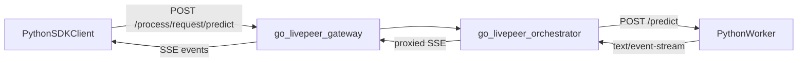

# BYOC SSE SDK Integration Plan

## Direction

Use the existing go-livepeer BYOC batch request path as the SSE transport: a Python worker returns `Content-Type: text/event-stream` from its capability route, and go-livepeer proxies that stream through `/process/request/...`. Do not add an SDK-hosted SSE server endpoint unless later testing proves the orchestrator needs a separate callback target. The SDK should act as a signed BYOC client and SSE reader.

Key existing behavior:

- [`/home/elite/repos/livepeer-python-gateway/examples/runner/hello_world/test.sh`](/home/elite/repos/livepeer-python-gateway/examples/runner/hello_world/test.sh) manually posts to `http://localhost:9935/process/request/predict` with a base64 `Livepeer` header.
- [`/home/elite/repos/go-livepeer/byoc/job_orchestrator.go`](/home/elite/repos/go-livepeer/byoc/job_orchestrator.go) already detects worker `text/event-stream` responses and forwards lines to the client while billing on a ticker.
- [`/home/elite/repos/go-livepeer/byoc/job_gateway.go`](/home/elite/repos/go-livepeer/byoc/job_gateway.go) already forwards orchestrator SSE back through the gateway.
- [`/home/elite/repos/python-gateway/src/livepeer_gateway/byoc.py`](/home/elite/repos/python-gateway/src/livepeer_gateway/byoc.py) currently starts live BYOC stream jobs via `/ai/stream/start`; it does not expose the batch `/process/request/{route}` call shape used by `test.sh`.

## Python SDK Changes

Add a BYOC batch request API in [`/home/elite/repos/python-gateway/src/livepeer_gateway/byoc.py`](/home/elite/repos/python-gateway/src/livepeer_gateway/byoc.py) that reuses the existing selection, signing, and payment code from `start_byoc_job`:

- Introduce request/response models such as `BYOCRequest` and `BYOCResponse`, or conservatively add `process_byoc_request(...)` next to `start_byoc_job`.
- Build the same signed `Livepeer` header payload already produced by `start_byoc_job`, but POST to `/process/request/{route}` rather than `/ai/stream/start`.
- Support JSON request bodies and route suffixes like `predict`, matching the current hello-world worker route rewrite.
- Handle `402 Payment Required` the same way `start_byoc_job` does: retry once with a fresh payment header.
- Return normal JSON/text responses for non-streaming workers and expose streaming responses for SSE workers.

Add an SSE reader module, likely [`/home/elite/repos/python-gateway/src/livepeer_gateway/sse.py`](/home/elite/repos/python-gateway/src/livepeer_gateway/sse.py):

- Use `aiohttp`, already a dependency, for async streaming reads.
- Parse standard SSE fields: `event`, `data`, `id`, `retry`, comments, blank-line event termination, and multi-line `data:` concatenation.
- Provide an async iterator API similar to `ChannelReader` and `JSONLReader` in [`/home/elite/repos/python-gateway/src/livepeer_gateway/channel_reader.py`](/home/elite/repos/python-gateway/src/livepeer_gateway/channel_reader.py).
- Add a convenience JSON mode that decodes `data:` payloads into dicts when possible, while preserving `[DONE]` as a terminal sentinel.
- Export the new API from [`/home/elite/repos/python-gateway/src/livepeer_gateway/__init__.py`](/home/elite/repos/python-gateway/src/livepeer_gateway/__init__.py).

Keep existing trickle control/event channels unchanged. They remain the right fit for live bidirectional text I/O started by `/ai/stream/start`; SSE is for worker-generated streaming responses over BYOC batch routes.

## Go-Livepeer Changes

Do not add a new SSE endpoint first. Instead, validate and harden the existing SSE proxy paths:

- In [`/home/elite/repos/go-livepeer/byoc/job_orchestrator.go`](/home/elite/repos/go-livepeer/byoc/job_orchestrator.go), add tests or targeted coverage for worker SSE forwarding via `/process/request/...`.
- In [`/home/elite/repos/go-livepeer/byoc/job_gateway.go`](/home/elite/repos/go-livepeer/byoc/job_gateway.go), add matching gateway proxy coverage if the SDK example goes through the gateway.
- Consider a small scanner hardening change in both files: set `scanner.Buffer(...)` so large `data:` events do not hit Go’s default `bufio.Scanner` token limit.
- Consider explicit `WriteHeader(http.StatusOK)` in the orchestrator SSE branch for parity with the gateway branch, if browser/client behavior or tests show headers are delayed.

## Examples

Add examples under [`/home/elite/repos/python-gateway/examples/`](/home/elite/repos/python-gateway/examples/) that mirror the hello-world pattern:

- `byoc_hello_world.py`: non-streaming SDK version of the current curl flow, calling the worker route `predict` and printing `{"message":"hello, livepeer"}`.
- `byoc_hello_world_sse.py`: SDK SSE version that calls the same BYOC route but expects an SSE worker response and prints events until `[DONE]`.
- Optionally add a small worker/example note showing the required worker behavior: route returns `Response(..., mimetype="text/event-stream")` from `/predict`.

Use the same configurable inputs as existing examples: orchestrator or gateway URL, signer/token/discovery options where applicable, capability name, timeout, and request body fields.

## Verification

Verify in layers:

- Python unit-level parser tests for SSE framing, multi-line data, comments, named events, `[DONE]`, and JSON decoding.
- SDK dry-run against a local simple SSE worker if possible.
- End-to-end compose flow modeled after [`/home/elite/repos/livepeer-python-gateway/examples/runner/hello_world/docker-compose.yml`](/home/elite/repos/livepeer-python-gateway/examples/runner/hello_world/docker-compose.yml): register `hello-world`, call `/process/request/predict` through go-livepeer, and assert the streamed hello-world events arrive through the SDK.
- Go tests for SSE proxy forwarding and scanner buffer behavior.

## Notes And Risks

The main design choice is to make the SDK a client for go-livepeer’s existing SSE proxy rather than a server. That keeps the SDK aligned with current orchestrator behavior and avoids adding a second streaming protocol beside trickle. The main implementation risk is payment/signing reuse: `start_byoc_job` has the right pieces, but the batch request path should factor those pieces carefully so live stream job start and batch SSE request do not drift.