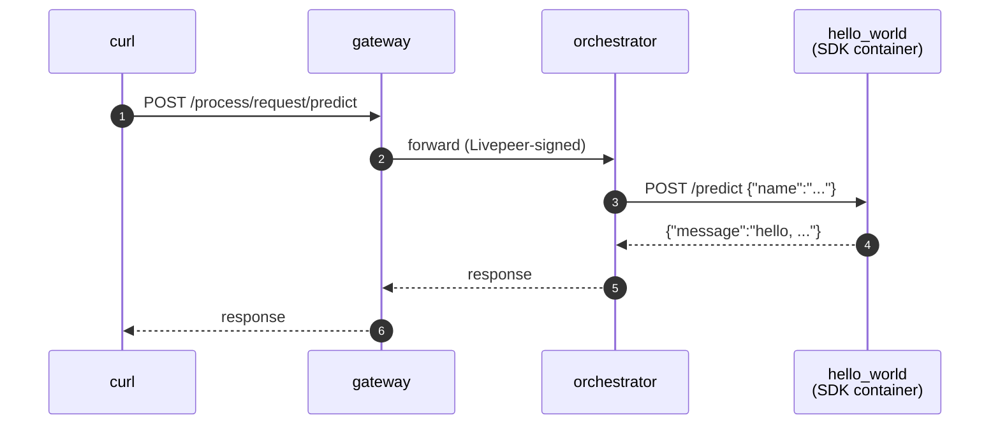

# Hello world (BYOC)

Smallest end-to-end test of the Pipeline SDK against a real
[go-livepeer](https://github.com/livepeer/go-livepeer) BYOC stack. A `Pipeline`
subclass returns `{"message": "hello, X"}` over HTTP. Registered as a BYOC
capability, called through the gateway, response flows back end-to-end.

## Run

```bash
docker compose up -d
./test.sh
docker compose down
```

`test.sh` prints `PASS` on success.

## What's running



Four compose services:

| Service | What it is |
| --- | --- |
| `gateway`, `orchestrator` | `livepeer/go-livepeer:master` from Docker Hub |
| `hello_world` | The pipeline container — a [BYOC](https://github.com/livepeer/go-livepeer/blob/main/doc/byoc.md) capability built with `livepeer_gateway.runner`. Attached via HTTP register, not the `-aiWorker` mechanism. |
| `register_capability` | One-shot helper that POSTs to `orchestrator:8935/capability/register` |

First `docker compose up` pulls `livepeer/go-livepeer:master` (~few hundred MB,
cached after) and builds the `hello_world` image locally.
