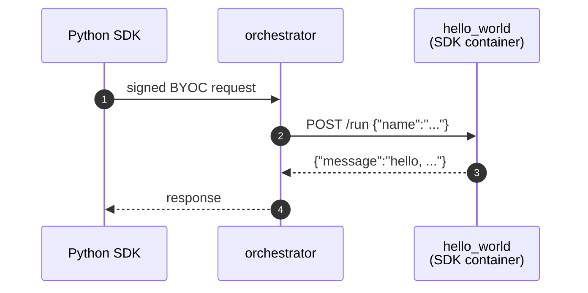

# Hello world (BYOC)

> [!NOTE]
> `test.sh` calls the BYOC capability through the Python SDK. Set
> `LIVEPEER_TOKEN` to a token with signer/discovery credentials before running
> the test.


Smallest end-to-end test of the Pipeline SDK against a real
[go-livepeer](https://github.com/livepeer/go-livepeer) BYOC stack. A `Pipeline`
subclass returns `{"message": "hello, X"}` over HTTP. Registered as a BYOC
capability, called through the Python SDK, and routed through the orchestrator.

## Run

> [!WARNING]
> Only one example can run at a time — all share container names
> (`orchestrator`, worker, …) and host ports (`1935`, `5000`). If
> `./test.sh` fails at the capability-registration step, run `docker
> compose down` in the other example's directory first.

```bash
docker compose up -d
export LIVEPEER_TOKEN=...
./test.sh
docker compose down
```

`test.sh` prints `PASS` on success.

## Browse the API

- Swagger UI: <http://localhost:5000/docs>
- ReDoc: <http://localhost:5000/redoc>
- OpenAPI JSON: <http://localhost:5000/openapi.json>

## What's running



Two compose services:

| Service | What it is |
| --- | --- |
| `orchestrator` | `livepeer/go-livepeer:master`, running with host networking |
| `hello_world` | The pipeline container — a [BYOC](https://github.com/livepeer/go-livepeer/blob/main/doc/byoc.md) capability built with `livepeer_gateway.runner`. Attached via HTTP register, not the `-aiWorker` mechanism. |
