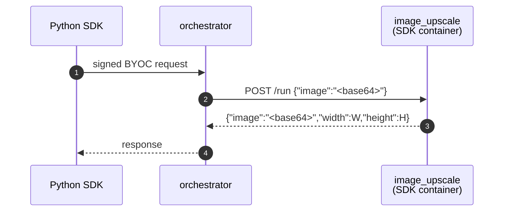

# Image upscale (BYOC)

> [!NOTE]
> `test.sh` calls this BYOC capability through the Python SDK. Set
> `LIVEPEER_TOKEN` to a token with signer/discovery credentials before running
> the test.


A ~2x image super-resolution BYOC capability — proves the SDK handles binary
I/O cleanly via Pydantic's `Base64Bytes`. Built on
[Swin2SR](https://huggingface.co/caidas/swin2SR-classical-sr-x2-64), small
enough to run on CPU.

A `Pipeline` subclass loads the model once in `setup()`, then takes a
base64-encoded image on each `POST /run` and returns the upscaled PNG.
The processor pads inputs to its window size before upscaling, so output
dimensions are at least 2x input but may be slightly larger. Registered as
a BYOC capability, called through the Python SDK, and routed through the
orchestrator.

## Run

> [!WARNING]
> Only one example can run at a time — all share container names
> (`orchestrator`, worker, …) and host ports (`1935`, `5000`). If
> `./test.sh` fails at the capability-registration step, run `docker
> compose down` in the other example's directory first.

```bash
docker compose up -d --wait --build
export LIVEPEER_TOKEN=...
./test.sh
docker compose down
```

`test.sh` prints `PASS` on success.

`prepare_models.py` bakes the model into the image at build time so
`setup()` loads from local cache in milliseconds.

## Browse the API

- Swagger UI: <http://localhost:5000/docs>
- ReDoc: <http://localhost:5000/redoc>
- OpenAPI JSON: <http://localhost:5000/openapi.json>

## What's running



Two compose services:

| Service                   | What it is                                                                                                                                         |
| ------------------------- | -------------------------------------------------------------------------------------------------------------------------------------------------- |
| `orchestrator`             | `livepeer/go-livepeer:master`, running with host networking                                                                                        |
| `image_upscale`           | The pipeline container — a [BYOC](https://github.com/livepeer/go-livepeer/blob/main/doc/byoc.md) capability built with `livepeer_gateway.runner`.  |

The pipeline service has a healthcheck that probes `GET /health` until the
model finishes loading. `register_capability` waits on `service_healthy`, so
the orchestrator never sees a "registered but not loaded" container.

## Binary I/O contract

Both `image` fields use Pydantic's `Base64Bytes`:

- **Input** — `image` is a base64-encoded string in the JSON body. Pydantic
  decodes to `bytes` before `run()` runs.
- **Output** — `image` is `bytes` in the pipeline; Pydantic encodes back to
  base64 in the JSON response.

`width` and `height` are returned alongside for convenience. The pipeline
always emits PNG; document the format in the field description if you need
to surface it to callers.

## Try with your own image

```bash
TEST_IMAGE=/path/to/your.png \
INPUT_WIDTH=$W INPUT_HEIGHT=$H \
./test.sh
```

The test asserts output is at least 2x input dimensions.

Or manually:

```bash
INPUT_B64=$(base64 -w0 < your.png)

PYTHONPATH=../../../src python3 ../byoc_request.py \
    --token "$LIVEPEER_TOKEN" \
    --capability image-upscale \
    --route run \
    --body-json "{\"image\":\"${INPUT_B64}\"}" \
    | jq -r '.image' | base64 -d > upscaled.png
```
