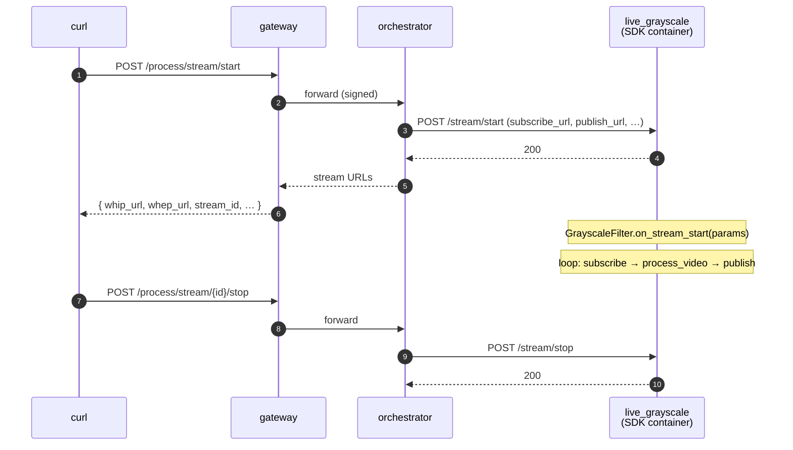

# Live grayscale (BYOC, real-time)

A minimal real-time video pipeline — proves the SDK's `LivePipeline`
abstraction end-to-end against go-livepeer's BYOC trickle protocol.
Each video frame's chroma planes are zeroed (U=V=128), producing a
grayscale output. Audio passes through unchanged.

The whole transform is one method:

```python
class GrayscaleFilter(LivePipeline):
    async def process_video(self, frame: VideoFrame) -> VideoFrame:
        av_frame = frame.frame
        if "yuv" in av_frame.format.name.lower():
            for plane_idx in (1, 2):
                plane = av_frame.planes[plane_idx]
                plane.update(bytes([128]) * (plane.line_size * plane.height))
        return frame
```

No model. No GPU. No external dependencies beyond the SDK. The point
is to validate the architecture — frame decode → user transform →
encode — against a real go-livepeer orchestrator + gateway. See the
issue tracker for a planned follow-up GPU example with a heavier
inference pipeline.

## Run

```bash
docker compose up -d --wait --build
./test.sh
docker compose down
```

`test.sh` prints `PASS` on success.

## What's running



Four compose services:

| Service                   | What it is                                                                                                                                                       |
| ------------------------- | ---------------------------------------------------------------------------------------------------------------------------------------------------------------- |
| `gateway`, `orchestrator` | `livepeer/go-livepeer:master` from Docker Hub                                                                                                                    |
| `live_grayscale`          | The pipeline container — a [BYOC](https://github.com/livepeer/go-livepeer/blob/main/doc/byoc.md) capability built with `livepeer_gateway.runner.LivePipeline`.   |
| `register_capability`     | One-shot helper that POSTs to `orchestrator:8935/capability/register` once `live_grayscale` is healthy                                                           |

The pipeline service has a healthcheck that probes `GET /health` until
`setup()` finishes (state machine reaches `OK`). `register_capability`
waits on `service_healthy`, so the orchestrator never sees a "registered
but not loaded" container.

## Wire contract (the parts that matter)

`POST /process/stream/start`'s `Livepeer:` header carries the job
envelope. Two fields drive what trickle channels the orchestrator
creates:

```json
{
  "capability": "live-video-to-video",
  "parameters": "{\"enable_video_ingress\":true,\"enable_video_egress\":true}",
  ...
}
```

| Flag (in `parameters`)       | Effect on the runner's `/stream/start` body |
| ---------------------------- | ------------------------------------------- |
| `enable_video_ingress: true` | Adds `subscribe_url`                        |
| `enable_video_egress: true`  | Adds `publish_url`                          |
| `enable_data_output: true`   | Adds `data_url` (not used here)             |

Verified against `byoc/stream_orchestrator.go:93-131` in go-livepeer.

## What `test.sh` covers (and what it doesn't)

✅ **Tested today:**

- Capability registration round-trip (`live-video-to-video`)
- Job envelope signing on the gateway side
- Stream-start handshake all the way to the runner's `/stream/start`
- Lifecycle hooks fire (`on_stream_start` runs in the runner's logs)
- Clean teardown via `/process/stream/{id}/stop`

❌ **Not yet tested in CI:**

- Pushing real MP2T to the WHIP/RTMP ingress
- Pulling the egress and asserting UV chroma planes are flat
- Frame-by-frame transform throughput

The media verification is a follow-up — a `TODO:` in `test.sh` tracks
it. Spike-risk: needs an ffmpeg-driven test source, a headless WHEP
pull, and a chroma-plane assertion. Landing the lifecycle smoke test
first proves the wire and lets media verification iterate independently.

