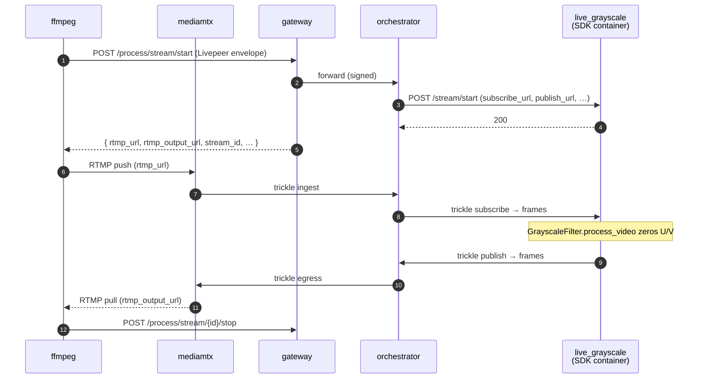

# Live grayscale (BYOC, real-time)

A minimal real-time video pipeline — proves the SDK's `LivePipeline`
abstraction end-to-end against go-livepeer's BYOC trickle protocol.
Each video frame's chroma planes are zeroed (U=V=128), producing a
grayscale output. Audio passes through unchanged.

The whole transform is one method:

```python
class GrayscaleFilter(LivePipeline):
    async def process_video(self, frame: VideoFrame) -> VideoFrame:
        av_frame = frame.frame
        if "yuv" in av_frame.format.name.lower():
            for plane_idx in (1, 2):
                plane = av_frame.planes[plane_idx]
                plane.update(bytes([128]) * (plane.line_size * plane.height))
        return frame
```

No model. No GPU. No external dependencies beyond the SDK. The point
is to validate the architecture — frame decode → user transform →
encode — against a real go-livepeer orchestrator + gateway. See the
issue tracker for a planned follow-up GPU example with a heavier
inference pipeline.

## Run

```bash
docker compose up -d --wait --build

./test.sh                          # CI: synthetic stream, asserts grayscale, opens ffplay
./demo.sh                          # interactive: webcam in, live grayscale ffplay window

docker compose down
```

### `test.sh` — automated assertion

1. Pushes a synthetic stream through the full BYOC chain
2. Captures the egress to `/tmp/live_grayscale_output.mts` and asserts
   the U/V chroma planes are ≈128 (i.e., the runner actually grayscaled
   the frames — bytes-received alone wouldn't catch a no-op `process_video`)
3. Opens the captured clip in **ffplay** so you can see the result
   (`SKIP_VIEWER=1 ./test.sh` skips this — useful in CI / over SSH)

`RETRIES=N` overrides the pull retry count (default 20) for fast-fail
iteration.

### `demo.sh` — live webcam viewer

Pushes your webcam through the pipeline and opens an ffplay window
showing the grayscale output in real time. Close the window or Ctrl-C
to stop.

Defaults to 320×240 @ 15fps. The PyAV encode loop is the sustained-throughput
bottleneck — 30fps stalls after ~10s on most hardware; 15fps holds steadily.

Bump either knob once you've confirmed your hardware keeps up:

```bash
WEBCAM_FPS=30 ./demo.sh                # smoother, may stall on slower CPUs
WEBCAM_RES=640x480 WEBCAM_FPS=15 ./demo.sh
WEBCAM_DEVICE=/dev/video1 ./demo.sh    # Linux: pick a different camera
```

If the live viewer disconnects mid-stream, you've hit the throughput ceiling —
drop FPS or resolution. The proper fix (drop policies in `MediaPublish`) is
tracked in [issue #8](https://github.com/livepeer/livepeer-python-gateway/issues/8).

| Platform | Source                                                        |
| -------- | ------------------------------------------------------------- |
| Linux    | `/dev/video0` via `v4l2` (override with `WEBCAM_DEVICE`)      |
| macOS    | First `avfoundation` device (override with `WEBCAM_DEVICE=N`) |

Requires `ffmpeg` and `ffplay` on the host.

## What's running



Five compose services:

| Service                   | What it is                                                                                                                                                                                                                                                                                  |
| ------------------------- | ------------------------------------------------------------------------------------------------------------------------------------------------------------------------------------------------------------------------------------------------------------------------------------------- |
| `gateway`, `orchestrator` | `livepeer/go-livepeer:master` from Docker Hub                                                                                                                                                                                                                                               |
| `mediamtx`                | RTMP frontend the gateway points at via `LIVE_AI_PLAYBACK_HOST`. Caller pushes RTMP here; processed output served back as RTMP. `mediamtx.yml` wires `runOnReady` to the gateway's BYOC ingest webhook; `Dockerfile.mediamtx` repackages the scratch image with curl so the webhook can fire. |
| `live_grayscale`          | The pipeline container — a [BYOC](https://github.com/livepeer/go-livepeer/blob/main/doc/byoc.md) capability built with `livepeer_gateway.runner.LivePipeline`.                                                                                                                              |
| `register_capability`     | One-shot helper that POSTs to `orchestrator:8935/capability/register` once `live_grayscale` is healthy                                                                                                                                                                                      |

The pipeline service has a healthcheck that probes `GET /health` until
`setup()` finishes (state machine reaches `OK`). `register_capability`
waits on `service_healthy`, so the orchestrator never sees a "registered
but not loaded" container.

## Wire contract (the parts that matter)

`POST /process/stream/start`'s `Livepeer:` header carries the job
envelope. Two fields drive what trickle channels the orchestrator
creates:

```json
{
  "capability": "live-video-to-video",
  "parameters": "{\"enable_video_ingress\":true,\"enable_video_egress\":true}",
  ...
}
```

| Flag (in `parameters`)       | Effect on the runner's `/stream/start` body |
| ---------------------------- | ------------------------------------------- |
| `enable_video_ingress: true` | Adds `subscribe_url`                        |
| `enable_video_egress: true`  | Adds `publish_url`                          |
| `enable_data_output: true`   | Adds `data_url` (not used here)             |

Verified against `byoc/stream_orchestrator.go:93-131` in go-livepeer.
