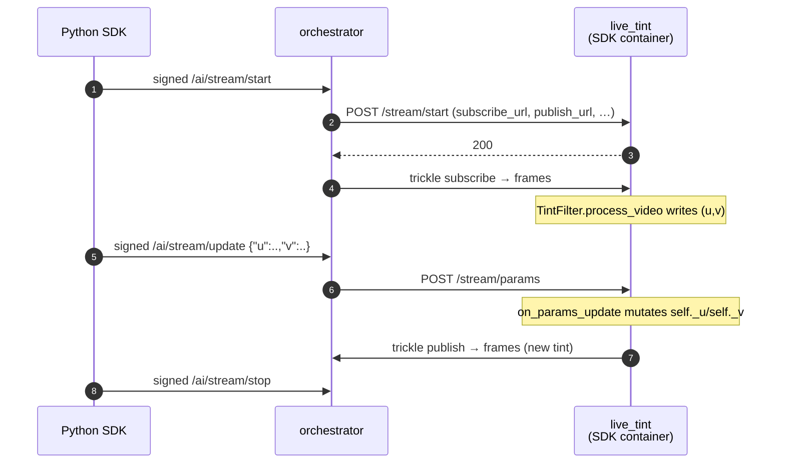

# Live tint (BYOC, real-time)

> [!NOTE]
> `test.sh` and `demo.sh` use the Python SDK for BYOC stream
> start/update/stop. Set `LIVEPEER_TOKEN` to a token with signer/discovery
> credentials before running them.


A minimal real-time video pipeline that doubles as the SDK's
**parameter-update demo**. Each video frame's chroma planes are
overwritten with a constant `(u, v)` pair — `(128, 128)` produces
grayscale, other values shift the tint. The caller can change `(u, v)`
mid-stream via `byoc_live.py update` and the next frame
reflects the new tint. Audio passes through unchanged.

The whole pipeline is three hooks:

```python
class TintFilter(LivePipeline):
    async def on_stream_start(self, params):           # initial params
        self._u = _clamp_byte(params.get("u"))         # default 128
        self._v = _clamp_byte(params.get("v"))         # default 128

    async def on_params_update(self, params):          # mid-stream updates
        if "u" in params: self._u = _clamp_byte(params["u"], default=self._u)
        if "v" in params: self._v = _clamp_byte(params["v"], default=self._v)

    async def process_video(self, frame):              # per-frame transform
        for plane_idx, value in ((1, self._u), (2, self._v)):
            plane = frame.frame.planes[plane_idx]
            plane.update(bytes([value]) * (plane.line_size * plane.height))
        return frame
```

No model. No GPU. The point is to validate the architecture — frame
decode → user transform → encode — and to show the safe pattern for
mutable per-session state: read initial params in `on_stream_start`,
mutate in `on_params_update`, read in `process_video`.

## Run

> [!WARNING]
> Only one example can run at a time — all share container names
> (`orchestrator`, worker, …) and host ports (`1935`, `5000`). If
> `./test.sh` fails at the capability-registration step, run `docker
> compose down` in the other example's directory first.

```bash
docker compose up -d --wait --build
export LIVEPEER_TOKEN=...

./test.sh                          # CI: synthetic stream, asserts default grayscale, opens ffplay
./demo.sh                          # interactive: webcam in, tint shifts mid-stream

docker compose down
```

### `test.sh` — automated assertion

1. Pushes a synthetic stream through the full BYOC chain
2. Captures the egress to `/tmp/live_tint_output.mts` and asserts the U/V
   chroma planes are ≈128 (i.e., the runner actually grayscaled the
   default-params frames — bytes-received alone wouldn't catch a no-op
   `process_video`)
3. Opens the captured clip in **ffplay** so you can see the result
   (`SKIP_VIEWER=1 ./test.sh` skips this — useful in CI / over SSH)

`RETRIES=N` overrides the pull retry count (default 20) for fast-fail
iteration.

### `demo.sh` — SDK stream session with mid-stream re-tinting

Starts a stream session with `byoc_live.py`, prints the publish/subscribe
URLs, and posts three `{"u", "v"}` updates through the SDK so the visible tint
cycles **blue → red → neutral** once media is being published.

```bash
./demo.sh
TINT_INTERVAL=2 ./demo.sh
```

#### Driving the tint by hand

Once `./demo.sh` is up (or any stream session is active) you can post
your own values from another shell:

```bash
PYTHONPATH=../../../src python3 ../byoc_live.py update \
  --job-file "$JOB_FILE" \
  --params-json '{"u": 60, "v": 200}'
```

`u` and `v` are bytes (0–255). 128/128 is neutral; shift `u` for blue↔yellow
and `v` for red↔green. Out-of-range or non-integer values are clamped /
ignored, never error the session.

## What's running



Three compose services:

| Service                   | What it is                                                                                                                                                                                                                                                                                  |
| ------------------------- | ------------------------------------------------------------------------------------------------------------------------------------------------------------------------------------------------------------------------------------------------------------------------------------------- |
| `orchestrator`            | `livepeer/go-livepeer:master`, running with host networking                                                                                                                                                                                                                                  |
| `mediamtx`                | Optional local RTMP helper for demos. The SDK owns stream start/update/stop.                                                                                                                                                                                                                  |
| `live_tint`               | The pipeline container — a [BYOC](https://github.com/livepeer/go-livepeer/blob/main/doc/byoc.md) capability built with `livepeer_gateway.runner.LivePipeline`.                                                                                                                              |

The pipeline service has a healthcheck that probes `GET /health` until
`setup()` finishes (state machine reaches `OK`). `register_capability`
waits on `service_healthy`, so the orchestrator never sees a "registered
but not loaded" container.

## Wire contract (the parts that matter)

The SDK's signed BYOC job envelope carries the job
envelope. Two fields drive what trickle channels the orchestrator
creates:

```json
{
  "capability": "live-tint",
  "parameters": "{\"enable_video_ingress\":true,\"enable_video_egress\":true}",
  ...
}
```

| Flag (in `parameters`)       | Effect on the runner's `/stream/start` body |
| ---------------------------- | ------------------------------------------- |
| `enable_video_ingress: true` | Adds `subscribe_url`                        |
| `enable_video_egress: true`  | Adds `publish_url`                          |
| `enable_data_output: true`   | Adds `data_url` (not used here)             |

Verified against `byoc/stream_orchestrator.go:93-131` in go-livepeer.

Mid-stream parameter updates flow through `/ai/stream/update` (orchestrator)
→ `POST /stream/params` (runner) → `LivePipeline.on_params_update`. The body is forwarded
unchanged — whatever JSON the caller posts becomes the `params` dict.
