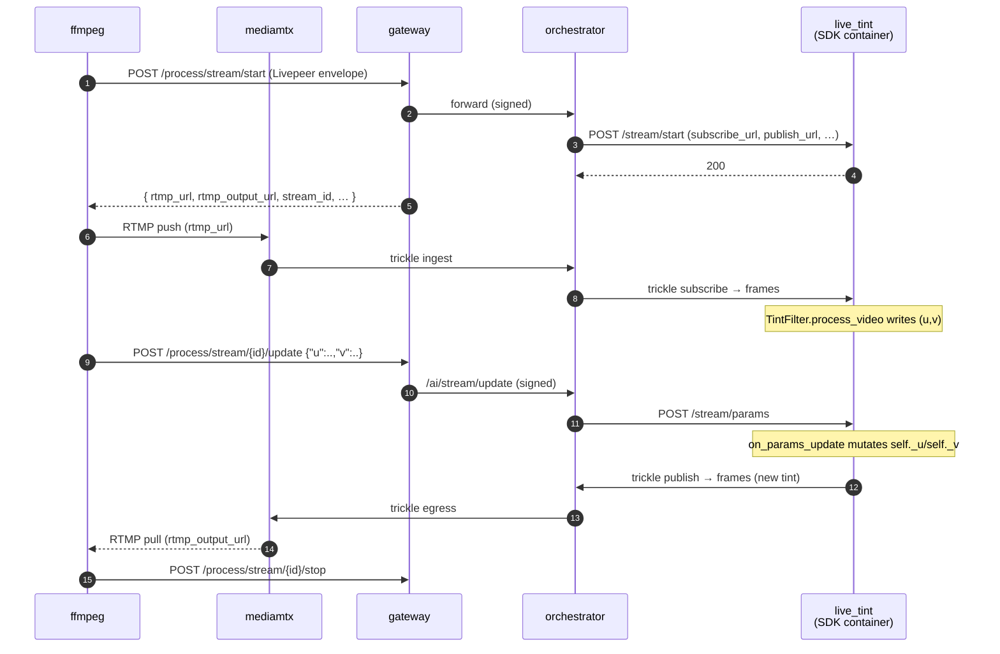

# Live tint (BYOC, real-time)

> [!NOTE]
> **TODO** — `test.sh`, `demo.sh`, and the `gateway:` compose service collapse into a single Python script using the client SDK once [livepeer/livepeer-python-gateway#6](https://github.com/livepeer/livepeer-python-gateway/pull/6) merges.


A minimal real-time video pipeline that doubles as the SDK's
**parameter-update demo**. Each video frame's chroma planes are
overwritten with a constant `(u, v)` pair — `(128, 128)` produces
grayscale, other values shift the tint. The caller can change `(u, v)`
mid-stream via `POST /process/stream/{id}/update` and the next frame
reflects the new tint. Audio passes through unchanged.

The whole pipeline is three hooks:

```python
class TintFilter(LivePipeline):
    async def on_stream_start(self, params):           # initial params
        self._u = _clamp_byte(params.get("u"))         # default 128
        self._v = _clamp_byte(params.get("v"))         # default 128

    async def on_params_update(self, params):          # mid-stream updates
        if "u" in params: self._u = _clamp_byte(params["u"], default=self._u)
        if "v" in params: self._v = _clamp_byte(params["v"], default=self._v)

    async def process_video(self, frame):              # per-frame transform
        for plane_idx, value in ((1, self._u), (2, self._v)):
            plane = frame.frame.planes[plane_idx]
            plane.update(bytes([value]) * (plane.line_size * plane.height))
        return frame
```

No model. No GPU. The point is to validate the architecture — frame
decode → user transform → encode — and to show the safe pattern for
mutable per-session state: read initial params in `on_stream_start`,
mutate in `on_params_update`, read in `process_video`.

## Run

```bash
docker compose up -d --wait --build

./test.sh                          # CI: synthetic stream, asserts default grayscale, opens ffplay
./demo.sh                          # interactive: webcam in, tint shifts mid-stream

docker compose down
```

### `test.sh` — automated assertion

1. Pushes a synthetic stream through the full BYOC chain
2. Captures the egress to `/tmp/live_tint_output.mts` and asserts the U/V
   chroma planes are ≈128 (i.e., the runner actually grayscaled the
   default-params frames — bytes-received alone wouldn't catch a no-op
   `process_video`)
3. Opens the captured clip in **ffplay** so you can see the result
   (`SKIP_VIEWER=1 ./test.sh` skips this — useful in CI / over SSH)

`RETRIES=N` overrides the pull retry count (default 20) for fast-fail
iteration.

### `demo.sh` — live webcam viewer with mid-stream re-tinting

Pushes your webcam through the pipeline and opens an ffplay window. After
a short warmup the script POSTs three `{"u", "v"}` updates to
`/process/stream/{id}/update` so the visible tint cycles **blue → red →
neutral** in real time. Close the window or Ctrl-C to stop.

```bash
./demo.sh                              # default: cycle through three tints
TINT_DELAY=0 ./demo.sh                 # stay grayscale (skip the cycle)
WEBCAM_FPS=30 ./demo.sh                # smoother, may stall on slower CPUs
WEBCAM_RES=640x480 WEBCAM_FPS=15 ./demo.sh
WEBCAM_DEVICE=/dev/video1 ./demo.sh    # Linux: pick a different camera
```

Defaults to 320×240 @ 15fps. The PyAV encode loop is the sustained-throughput
bottleneck — 30fps stalls after ~10s on most hardware; 15fps holds steadily.
If the live viewer disconnects mid-stream, you've hit the throughput ceiling —
drop FPS or resolution. The proper fix (drop policies in `MediaPublish`) is
tracked in [issue #8](https://github.com/livepeer/livepeer-python-gateway/issues/8).

| Platform | Source                                                        |
| -------- | ------------------------------------------------------------- |
| Linux    | `/dev/video0` via `v4l2` (override with `WEBCAM_DEVICE`)      |
| macOS    | First `avfoundation` device (override with `WEBCAM_DEVICE=N`) |

Requires `ffmpeg` and `ffplay` on the host.

#### Driving the tint by hand

Once `./demo.sh` is up (or any stream session is active) you can post
your own values from another shell:

```bash
curl -fsS -X POST "http://localhost:9935/process/stream/${STREAM_ID}/update" \
  -H "Livepeer: ${LIVEPEER_HDR}" \
  -H "Content-Type: application/json" \
  -d '{"u": 60, "v": 200}'   # warm/red
```

`u` and `v` are bytes (0–255). 128/128 is neutral; shift `u` for blue↔yellow
and `v` for red↔green. Out-of-range or non-integer values are clamped /
ignored, never error the session.

## What's running



Five compose services:

| Service                   | What it is                                                                                                                                                                                                                                                                                  |
| ------------------------- | ------------------------------------------------------------------------------------------------------------------------------------------------------------------------------------------------------------------------------------------------------------------------------------------- |
| `gateway`, `orchestrator` | `livepeer/go-livepeer:master` from Docker Hub                                                                                                                                                                                                                                               |
| `mediamtx`                | RTMP frontend the gateway points at via `LIVE_AI_PLAYBACK_HOST`. Caller pushes RTMP here; processed output served back as RTMP. `mediamtx.yml` wires `runOnReady` to the gateway's BYOC ingest webhook; `Dockerfile.mediamtx` repackages the scratch image with curl so the webhook can fire. |
| `live_tint`               | The pipeline container — a [BYOC](https://github.com/livepeer/go-livepeer/blob/main/doc/byoc.md) capability built with `livepeer_gateway.runner.LivePipeline`.                                                                                                                              |
| `register_capability`     | One-shot helper that POSTs to `orchestrator:8935/capability/register` once `live_tint` is healthy                                                                                                                                                                                           |

The pipeline service has a healthcheck that probes `GET /health` until
`setup()` finishes (state machine reaches `OK`). `register_capability`
waits on `service_healthy`, so the orchestrator never sees a "registered
but not loaded" container.

## Wire contract (the parts that matter)

`POST /process/stream/start`'s `Livepeer:` header carries the job
envelope. Two fields drive what trickle channels the orchestrator
creates:

```json
{
  "capability": "live-tint",
  "parameters": "{\"enable_video_ingress\":true,\"enable_video_egress\":true}",
  ...
}
```

| Flag (in `parameters`)       | Effect on the runner's `/stream/start` body |
| ---------------------------- | ------------------------------------------- |
| `enable_video_ingress: true` | Adds `subscribe_url`                        |
| `enable_video_egress: true`  | Adds `publish_url`                          |
| `enable_data_output: true`   | Adds `data_url` (not used here)             |

Verified against `byoc/stream_orchestrator.go:93-131` in go-livepeer.

Mid-stream parameter updates flow `POST /process/stream/{id}/update`
(gateway) → `/ai/stream/update` (orchestrator) → `POST /stream/params`
(runner) → `LivePipeline.on_params_update`. The body is forwarded
unchanged — whatever JSON the caller posts becomes the `params` dict.
