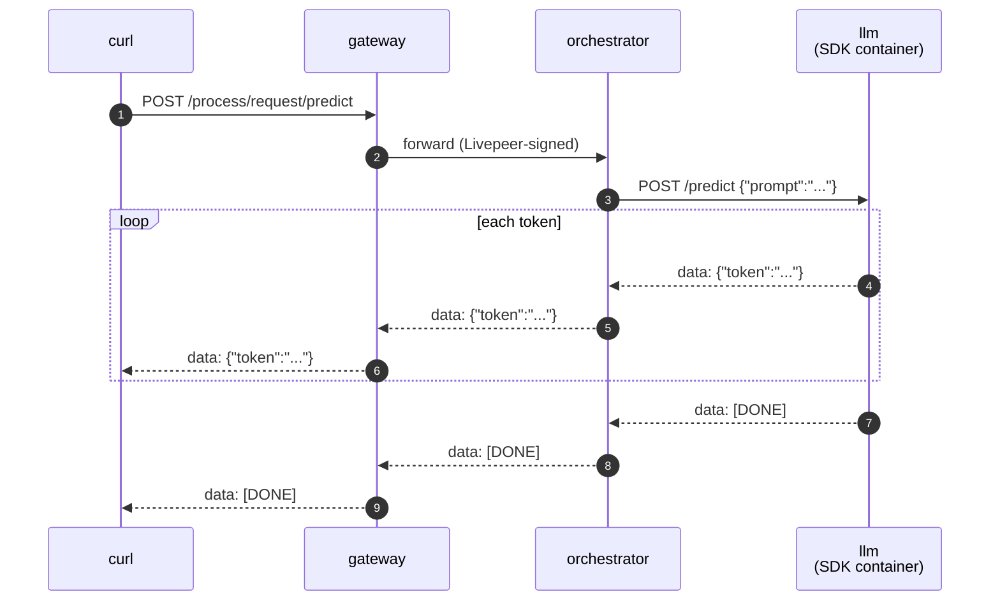

# LLM chat (BYOC, streaming)

> [!NOTE]
> **TODO** — `test.sh` and the `gateway:` compose service collapse into a single Python script using the client SDK once [livepeer/livepeer-python-gateway#6](https://github.com/livepeer/livepeer-python-gateway/pull/6) merges.


A streaming chat capability built on
[Qwen2.5-0.5B-Instruct](https://huggingface.co/Qwen/Qwen2.5-0.5B-Instruct) —
small enough to run on CPU. Demonstrates the SDK's SSE pattern: `predict()`
returns an iterator, the SDK detects the generator and frames each yielded
value as a Server-Sent Event.

A `Pipeline` subclass loads the model once in `setup()`, then streams tokens
on each `POST /predict` via HuggingFace's `TextIteratorStreamer`. Registered
as a BYOC capability, called through the gateway, response flows back end-to-end.

## Run

```bash
docker compose up -d --wait --build
./test.sh
docker compose down
```

`test.sh` prints `PASS` on success.

`prepare_models.py` bakes the model into the image at build time so
`setup()` loads from local cache in milliseconds.

## Browse the API

- Swagger UI: <http://localhost:5000/docs>
- ReDoc: <http://localhost:5000/redoc>
- OpenAPI JSON: <http://localhost:5000/openapi.json>

## What's running



Four compose services:

| Service                   | What it is                                                                                                       |
| ------------------------- | ---------------------------------------------------------------------------------------------------------------- |
| `gateway`, `orchestrator` | `livepeer/go-livepeer:master` from Docker Hub                                                                    |
| `llm`                     | The pipeline container — runs the model in-process, streams tokens via `TextIteratorStreamer`                    |
| `register_capability`     | One-shot helper that registers the `llm` capability once the pipeline is healthy                                 |

## Streaming contract

`predict()` returns `Iterator[ChatChunk]`. The SDK detects the generator and
wraps the response with `Content-Type: text/event-stream`. Each yielded
`ChatChunk` becomes an SSE event, terminated by `[DONE]`:

```text
data: {"token": "Hello"}

data: {"token": " world"}

data: [DONE]

```

Both go-livepeer and the Python caller-side gateway watch for `[DONE]` to
end the stream.

## Try it yourself

```bash
LIVEPEER_HDR=$(printf '%s' \
  '{"request":"{}","parameters":"{}","capability":"llm","timeout_seconds":120}' \
  | base64 -w0)

curl -N -X POST http://localhost:9935/process/request/predict \
    -H "Livepeer: ${LIVEPEER_HDR}" \
    -H 'Content-Type: application/json' \
    -d '{"prompt":"Tell me a joke"}'
```

`-N` disables curl's output buffering so each token arrives as it's generated.
