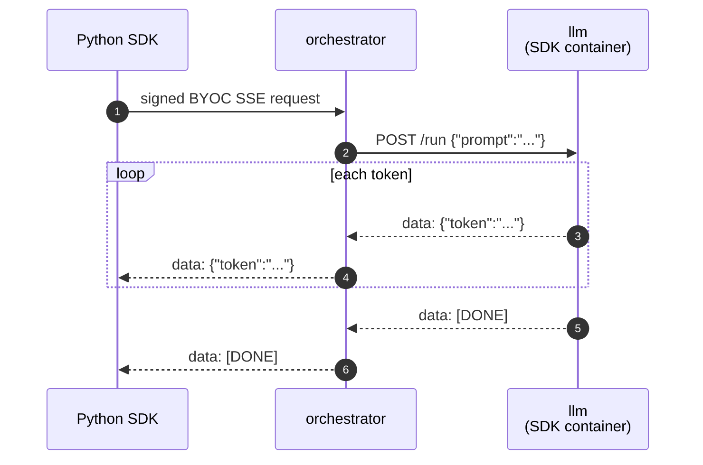

# LLM chat (BYOC, streaming)

> [!NOTE]
> `test.sh` calls this streaming BYOC capability through the Python SDK. Set
> `LIVEPEER_TOKEN` to a token with signer/discovery credentials before running
> the test.


A streaming chat capability built on
[Qwen2.5-0.5B-Instruct](https://huggingface.co/Qwen/Qwen2.5-0.5B-Instruct) —
small enough to run on CPU. Demonstrates the SDK's SSE pattern: `run()`
returns an iterator, the SDK detects the generator and frames each yielded
value as a Server-Sent Event.

A `Pipeline` subclass loads the model once in `setup()`, then streams tokens
on each `POST /run` via HuggingFace's `TextIteratorStreamer`. Registered
as a BYOC capability, called through the Python SDK, and streamed back as SSE.

## Run

> [!WARNING]
> Only one example can run at a time — all share container names
> (`orchestrator`, worker, …) and host ports (`1935`, `5000`). If
> `./test.sh` fails at the capability-registration step, run `docker
> compose down` in the other example's directory first.

```bash
docker compose up -d --wait --build
export LIVEPEER_TOKEN=...
./test.sh
docker compose down
```

`test.sh` prints `PASS` on success.

`prepare_models.py` bakes the model into the image at build time so
`setup()` loads from local cache in milliseconds.

## Browse the API

- Swagger UI: <http://localhost:5000/docs>
- ReDoc: <http://localhost:5000/redoc>
- OpenAPI JSON: <http://localhost:5000/openapi.json>

## What's running



Four compose services:

| Service                   | What it is                                                                                                       |
| ------------------------- | ---------------------------------------------------------------------------------------------------------------- |
| `orchestrator`             | `livepeer/go-livepeer:master`, running with host networking                                                      |
| `llm`                     | The pipeline container — runs the model in-process, streams tokens via `TextIteratorStreamer`                    |
| `register_capability`     | One-shot helper that registers the `llm` capability once the pipeline is healthy                                 |

## Streaming contract

`run()` returns `Iterator[ChatChunk]`. The SDK detects the generator and
wraps the response with `Content-Type: text/event-stream`. Each yielded
`ChatChunk` becomes an SSE event, terminated by `[DONE]`:

```text
data: {"token": "Hello"}

data: {"token": " world"}

data: [DONE]

```

The Python SDK caller watches for `[DONE]` to end the stream.

## Try it yourself

```bash
PYTHONPATH=../../../src python3 ../byoc_request.py \
    --token "$LIVEPEER_TOKEN" \
    --capability llm \
    --route run \
    --stream \
    --body-json '{"prompt":"Tell me a joke"}'
```

The helper prints SSE lines as each token arrives.
