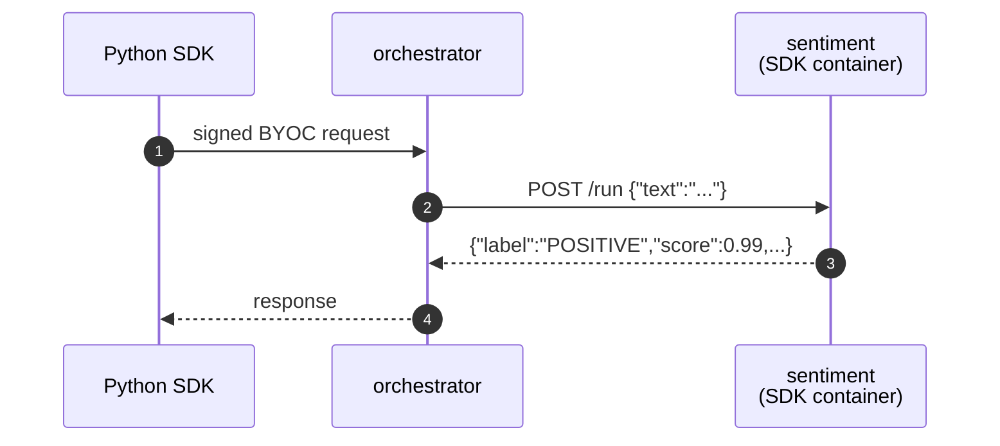

# Sentiment analysis (BYOC)

> [!NOTE]
> `test.sh` calls this BYOC capability through the Python SDK. Set
> `LIVEPEER_TOKEN` to a token with signer/discovery credentials before running
> the test.


A Hugging Face sentiment classifier shipped as a BYOC capability. Demonstrates
the `setup()` lifecycle hook for one-time model loading. Built on
[distilbert-base-uncased-finetuned-sst-2-english](https://huggingface.co/distilbert/distilbert-base-uncased-finetuned-sst-2-english) — small enough to run on CPU.

A `Pipeline` subclass loads the model once in `setup()`, then classifies text
on each `POST /run`. Registered as a BYOC capability, called through the
Python SDK, and routed through the orchestrator.

## Run

> [!WARNING]
> Only one example can run at a time — all share container names
> (`orchestrator`, worker, …) and host ports (`1935`, `5000`). If
> `./test.sh` fails at the capability-registration step, run `docker
> compose down` in the other example's directory first.

```bash
docker compose up -d --wait --build
export LIVEPEER_TOKEN=...
./test.sh
docker compose down
```

`test.sh` prints `PASS` on success.

`prepare_models.py` bakes the model into the image at build time so
`setup()` loads from local cache in milliseconds.

## Browse the API

- Swagger UI: <http://localhost:5000/docs>
- ReDoc: <http://localhost:5000/redoc>
- OpenAPI JSON: <http://localhost:5000/openapi.json>

## What's running



Two compose services:

| Service                   | What it is                                                                                                                                                                         |
| ------------------------- | ---------------------------------------------------------------------------------------------------------------------------------------------------------------------------------- |
| `orchestrator`             | `livepeer/go-livepeer:master`, running with host networking                                                                                                                        |
| `sentiment`               | The pipeline container — a [BYOC](https://github.com/livepeer/go-livepeer/blob/main/doc/byoc.md) capability built with `livepeer_gateway.runner`. Loads the HF model in `setup()`. |

The sentiment service has a healthcheck that probes `GET /health` until the
model finishes loading. `register_capability` waits on `service_healthy`, so
the orchestrator never sees a "registered but not loaded" container.

## Try variations

```bash
TEXT="this is awful" EXPECTED_LABEL=NEGATIVE ./test.sh
```

Or manually:

```bash
PYTHONPATH=../../../src python3 ../byoc_request.py \
    --token "$LIVEPEER_TOKEN" \
    --capability sentiment \
    --route run \
    --body-json '{"text":"distributed inference is the future"}'
```
