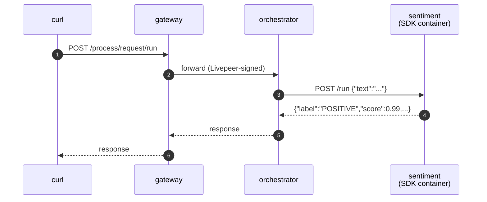

# Sentiment analysis (BYOC)

> [!NOTE]
> **TODO** — `test.sh` and the `gateway:` compose service collapse into a single Python script using the client SDK once [livepeer/livepeer-python-gateway#6](https://github.com/livepeer/livepeer-python-gateway/pull/6) merges.


A Hugging Face sentiment classifier shipped as a BYOC capability. Demonstrates
the `setup()` lifecycle hook for one-time model loading. Built on
[distilbert-base-uncased-finetuned-sst-2-english](https://huggingface.co/distilbert/distilbert-base-uncased-finetuned-sst-2-english) — small enough to run on CPU.

A `Pipeline` subclass loads the model once in `setup()`, then classifies text
on each `POST /run`. Registered as a BYOC capability, called through the
gateway, response flows back end-to-end.

## Run

> [!WARNING]
> Only one example can run at a time — all share container names
> (`gateway`, `orchestrator`, …) and ports (`1935`, `9935`, `5000`). If
> `./test.sh` fails at the capability-registration step, run `docker
> compose down` in the other example's directory first.

```bash
docker compose up -d --wait --build
./test.sh
docker compose down
```

`test.sh` prints `PASS` on success.

`prepare_models.py` bakes the model into the image at build time so
`setup()` loads from local cache in milliseconds.

## Browse the API

- Swagger UI: <http://localhost:5000/docs>
- ReDoc: <http://localhost:5000/redoc>
- OpenAPI JSON: <http://localhost:5000/openapi.json>

## What's running



Four compose services:

| Service                   | What it is                                                                                                                                                                         |
| ------------------------- | ---------------------------------------------------------------------------------------------------------------------------------------------------------------------------------- |
| `gateway`, `orchestrator` | `livepeer/go-livepeer:master` from Docker Hub                                                                                                                                      |
| `sentiment`               | The pipeline container — a [BYOC](https://github.com/livepeer/go-livepeer/blob/main/doc/byoc.md) capability built with `livepeer_gateway.runner`. Loads the HF model in `setup()`. |
| `register_capability`     | One-shot helper that POSTs to `orchestrator:8935/capability/register` once `sentiment` is healthy                                                                                  |

The sentiment service has a healthcheck that probes `GET /health` until the
model finishes loading. `register_capability` waits on `service_healthy`, so
the orchestrator never sees a "registered but not loaded" container.

## Try variations

```bash
TEXT="this is awful" EXPECTED_LABEL=NEGATIVE ./test.sh
```

Or manually:

```bash
LIVEPEER_HDR=$(printf '%s' '{"request":"{}","parameters":"{}","capability":"sentiment","timeout_seconds":30}' | base64 -w0)

curl -X POST http://localhost:9935/process/request/run \
    -H "Livepeer: ${LIVEPEER_HDR}" \
    -H "Content-Type: application/json" \
    -d '{"text":"distributed inference is the future"}'
```
